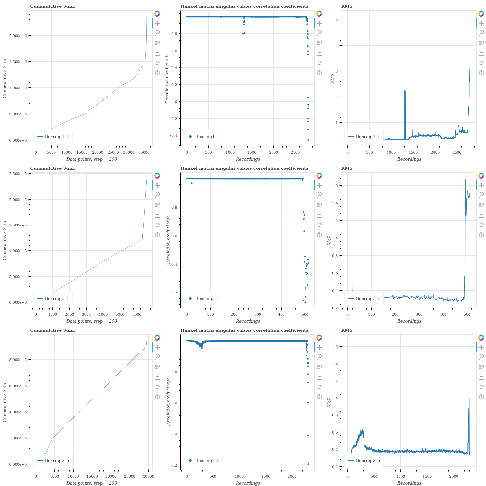
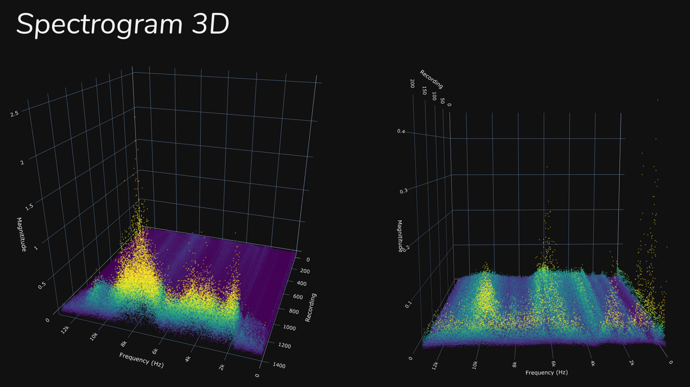
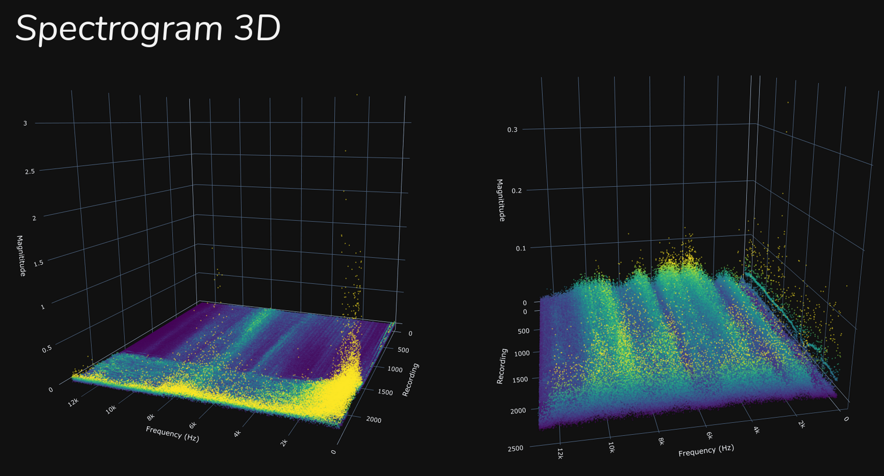
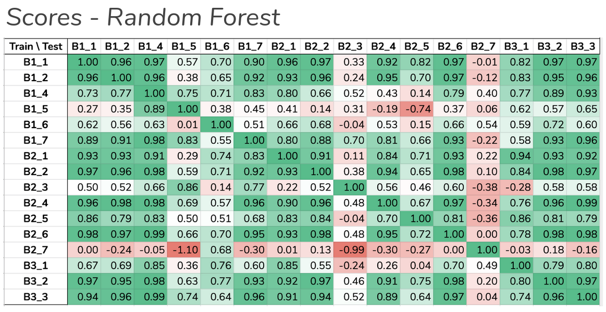
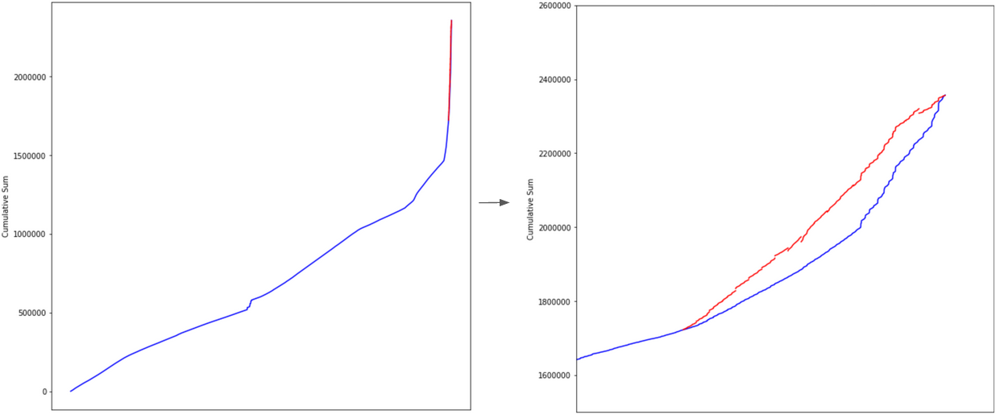
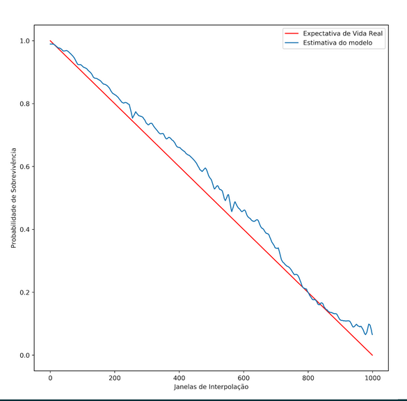
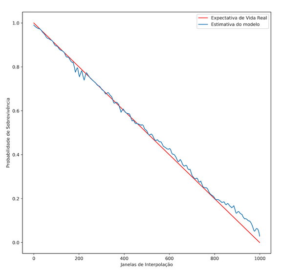
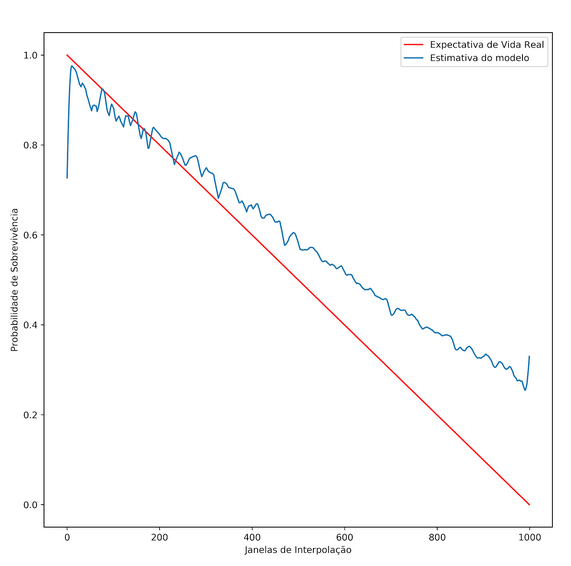

# Bearing RUL Predict
This project aims to predict the remaining useful life of a bearing by analysing vibration data with Random Forest regressor. We currently built a failure probability estimator by trainning the Random Forest regressor with polynomial coefficients of a cummulative sum curve and a linear decreasing array (1 to 0) which starts from the explosion index (where a correlation coefficient stats to fall) to the end of the bearing life.

\* The correlation coefficient is used to assess the condition of bearing degradation.

# Installing and configuring required packages
```
pip install -r requirements.txt
```
\* If you want to use the derivative function (Implemented using Cython) :
```
python setup.py build_ext --inplace
```

# Jupyter Notebooks
## dataset_csv_merge
This notebook process all .csv in orignal FEMTO dataset. For each bearing, it:
1. Merge all .csv files of acceleration
2. Merge all .csv files of temperatures
3. Removes μs from accelaration .csv files
4. Create folders for processed data

\* It also checks the .csv separator and use ',' separator in the merged .csv file 

(In original FEMTO dataset some files are separated by ',' and others by ';'). 

## data_processing
This notebook loads the bearing model with the specified data (.csv or binary) and compute the needed results for regression (cumsum, hankel matrix singular values and correlation coefficients).
It also process some other data analysis functions (fft, emd, rms, ...) which are commented. In the end there are some plots to see the results.

## regression
This notebook:
1. Loads cumsum and correlation coefficients
2. Define a bearing for training
3. Train a random forest model where X are the coefficients of a fitted polynomial in cumsum data and Y are an decreasing array (from 1 to 0) which size is the number of recordings from the explosion index (index where the correlation coefficient is bellow 0.95) to the end of life. 
4. Test in all bearings

## failure_probability_predict
To be documented.

# Results

## Cummulative sum, RMS and Correlation coefficients from some bearings:



## FFT Spectrogram of some bearings. The plot is ( frequency X time X amplitude ):



## Random Forest Scores.
### The first column is the bearing used to train and the first row is the bearing used to test. 


\* We choose Bearing 2_4 for trainning.

## Bearing1_1 cummulative sum coefficient interpolation (second image is a zoom in the inperpolation part):


## Failure probability prediction
### Bearing failure probability. Red is the real life expectancy and blue is the predicted.






# Analysing Code Performance - cProfile
```
python -m cProfile -o results.prof code.py
```
* You can use snakeviz to visualize the profiler results.

```
pip install snakeviz

snakeviz results.prof
```

# Original datasets files
### [FEMTO bearing dataset ¹.](https://ti.arc.nasa.gov/tech/dash/groups/pcoe/prognostic-data-repository/)

# Next steps

- Use the regressor to predict RUL time.
- Document failure_probability_predict notebook.


# Developers
* [Bruna Yukari Fujii Yoshida](https://github.com/brunayfy)
* [Danilo Barbosa](https://github.com/danilobso)
* [Matheus Carvalho Nali](https://github.com/matheuscnali)

# References
<a id="1">[1] </a> Patrick Nectoux, Rafael Gouriveau, Kamal Medjaher, Emmanuel Ramasso, Brigitte Chebel-Morello,
et al.. PRONOSTIA : An experimental platform for bearings accelerated degradation tests.. IEEE
International Conference on Prognostics and Health Management, PHM’12., Jun 2012, Denver, Colorado, United States. pp.1-8. hal-00719503
