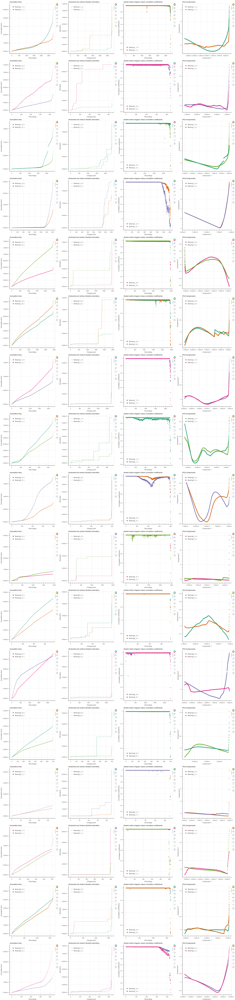

# Bearing RUL Predict

## Installing required packages
```
pip install -r requirements.txt
```

## Organizing data folder
This project expects a data folder in root with the following structure:

```
.
├── Bearing-RUL-Predict
    ├── data
        ├── original_data
        │   ├── dataset1
        |   |   ├── Bearing1
        |   |   |   ├── file1.csv      
        |   |   |   ├── file2.csv
        |   |   |   ├── ...
        |   |   ├── Bearing2
        |   |   |   ├── file1.csv      
        |   |   |   ├── file2.csv
        |   |   ├── ...
        │   ├── dataset2
        |   |   ├── Bearing1
        |   |   |   ├── ...
        |   |   ├── Bearing2
        |   |   |   ├── ...
        |   |   ├── ...
        │   └── ...
        └── processed_data
```

A data folder with FEMTO bearing dataset ¹ and processed data results is avaliable at this [link](https://drive.google.com/drive/folders/1dP97Tozd2TA2jZTYULV4Z9pLmro3gV6W?usp=sharing).

## Run
```
jupyter-notebook main.ipynb
```
## Analysing Code Performance - cProfile
```
python -m cProfile -o results.prof code.py
```
* You can use snakeviz to visualize the profiler results.

```
pip install snakeviz

snakeviz results.prof
```

## Some results using FEMTO dataset


## Original datasets files.
### [FEMTO bearing dataset.](https://ti.arc.nasa.gov/tech/dash/groups/pcoe/prognostic-data-repository/)


## References
<a id="1">[1] </a> Patrick Nectoux, Rafael Gouriveau, Kamal Medjaher, Emmanuel Ramasso, Brigitte Chebel-Morello,
et al.. PRONOSTIA : An experimental platform for bearings accelerated degradation tests.. IEEE
International Conference on Prognostics and Health Management, PHM’12., Jun 2012, Denver, Colorado, United States. pp.1-8. hal-00719503